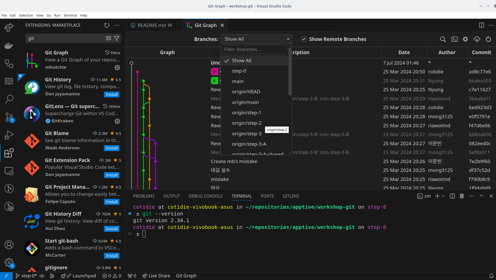
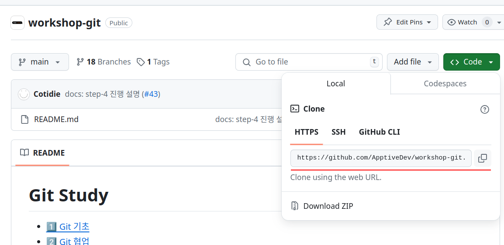

# 0️⃣ Git 설정
원활한 Git 워크샵 진행을 위해 환경 설정을 사전 점검합니다.

## 도구 설치
워크샵은 Visual Studio Code와 Git CLI를 기준으로 진행합니다. 단, 편의에 따라 Git CLI 대신 Github Desktop, SourceTree 등 GUI 툴을 활용해도 됩니다. 사전 점검 이전에 다음의 개발 도구가 모두 설치되어 있는지 확인바랍니다.

### Git
| 🔗 https://git-scm.com/downloads
1. git-scm (공식) 페이지에서 git 최신 버전을 다운로드 받습니다.
2. `Git Bash` 또는 터미널 창에 `git --version`을 입력해 정상 설치 여부를 확인합니다.
```bash
# 정상 설치 여부 확인
$ git --version
git version 2.34.1
```

### VS Code Plugins
  

| 🔗 https://code.visualstudio.com/
1. (VS Code가 없다면) visual studio 홈페이지에서 최신 버전을 설치합니다.
2. VS Code를 실행하고, 좌측 `Extensions` 탭에서 다음 두 가지 플러그인을 설치합니다.
   - **Git Graph**: Commit 기록을 한 눈에 확인하고, reset/rebase 등 다양한 기능 지원
   - **Git Lens**: 코드 편집 중 Commit 작성자를 쉽게 확인할 수 있음
3. 좌측 하단에 `Git Graph` 버튼으로 Commit 기록을 확인합니다.
   - Git Graph 버튼이 생기지 않았다면 VS Code 재실행

## 사전 점검
### ❗️ Write Access 요청
1. APPTIVE 운영진에게 자신의 Github 닉네임과 이메일 주소를 전달합니다.
2. 워크샵 레포(현재 레포)에 대한 쓰기 권한을 부여받습니다.
   - 브랜치를 직접 생성하며 진행할 것이기에 사전에 반드시 권한을 요청하시기 바랍니다.

### Push 테스트
  

1. 현재 레포를 로컬에 Clone 합니다.
```bash
$ git clone <Git Clone 주소 (스크린샷 참고)>
$ cd workshop-git
```
2. `step-0` 브랜치로 이동합니다.
```bash
$ git checkout step-0
```
3. `/playground`에 자신의 이름을 딴 텍스트 파일을 하나 만들고 내용을 채운 후 push 합니다.
```bash
$ echo "aaaa" > ./playground/본인_이름.txt
$ git add .
$ git commit -m "step-0 사전설정 테스트"
$ git push
```

만약 git push에 오류가 생긴다면 운영진에게 문의주시고, 워크샵 이전에 해결할 수 있도록 합니다.