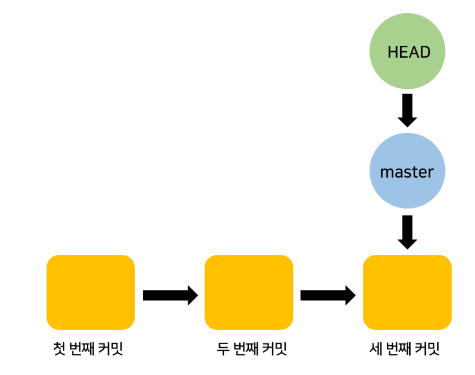

# Git 기초

## Git != Github
  
git과 github는 같은 의미가 아닙니다.  
local, remote와 연관지어 적어주세요.
- git
   - local에서 프로젝트 기록을 스스로 관리할 수 있다. 
   - 다른 개발자와 코드를 실시간으로 공유할 수 없다. 
   - **버전 관리 '프로그램'**
- github
  - 클라우드 서버를 사용하여 local에서 버전 관리한 코드를 업로드하여 공유 가능하다.
  - **버전 관리, 소스 코드 공유, 분산 버전 제어 등이 가능한 원격 저장소**

## Git Workflow
  
위는 git이 어떻게 동작하는지 나타낸 다이어그램입니다.  
Working Directory, Git Add, Git Commit, Git Push 등 각 항목에 대해 작성 바랍니다.  
Git Merge, Git Fetch는 생략해도 됩니다.
- Working Directory
  - 실제 코드를 수정&추가하여 변경이 이루어지는 영역
  - git 이력과 관련된 정보가 저장되어 있는 .git 을 제외한 모든 영역
- git add
  - 현재 Working Directory 상의 변경 내용을 Staging Area로 이동시키는 명령어, 새로운 파일이 생겼다는 것을 알리는 행위
    - Staging Area : Working Directory 에서 Repository로 정보가 저장되기 전 준비 영역

- git commit
  - 파일 및 폴더의 변경 사항을 Local Repository에 기록하는 명령어
  - 특정 작업이 완결된 상태로 바뀌었다는 것을 의미함

- git push
  - 변경 사항을 Remote Repository에 기록하는 명령어

## Branch, HEAD
  
git이 동작하는 기본 단위는 commit과 branch입니다.  
branch와 HEAD, git checkout을 포함하여 작성 바랍니다.  
branch 생성 및 삭제, 이동 커맨드 등 자유롭게 내용을 추가해주세요.
- branch : 독립적으로 작업을 진행하기 위한 개념
- HEAD : branch의 가장 최신 commit을 가리키는 포인터
- branch와 HEAD
  - commit을 하면 HEAD가 가리키는 branch가 최신 commit으로 이동한다.
  - 

  - 여기서 highlevel branch를 만들면 highlevel branch은 HEAD가 가리키던 커밋을 가리키게 된다.
  - 

  - **git checkout highlevel**을 입력하면 HEAD가 highlevel branch를 가리키게 된다.
  - 

  - 여기서 commit을 2번 진행하면 아래와 같이 된다.
  - 

- [출처 : https://charles098.tistory.com/24]
  

## clone, init, origin
리포지토리를 로컬에 생성하는 방법은 clone, init이 있습니다. 다음을 포함하여 작성 바랍니다.
- git clone과 git init의 차이점, 이용방법
  - git clone : 저장소로부터 프로젝트를 복제하는 명령어
  - git init : 해당 폴더를 git으로 관리할 수 있게 해주는 명령어
  - git clone은 **기존 저장소를 복제하는 것** / git init은 **기존에 사용하던 디렉토리를 Git 저장소로 만드는 것**
- origin이란 키워드는 무엇인지, 어떻게 설정하는지
  - origin : 깃허브 저장소 주소를 가리키는 키워드
  - git remote add origin {원격 저장소 주소} : 로컬 저장소에 원격 저장소를 등록
  - git remote remove origin : 원격 저장소를 git의 설정에서 삭제

## reset
  
reset에는 3가지 타입이 있습니다.  
각 타입에 대해 작성 바랍니다.
- git reset <커밋ID> : 과거 commit 지점으로 이동하고, 이동된 이후의 commit은 삭제하는 명령어
  1. git reset –hard : 해당 커밋ID의 상태로 이동하고, Working Directory와 Index영역 모두 초기화한다.
  2. git reset –mixed : 해당 커밋ID의 상태로 이동하고, Index영역은 초기화되고 Working Directory는 변경되지 않는다.
  3. git reset –soft : 해당 커밋ID의 상태로 이동하고, Index영역과 Working Directory 모두 변경되지 않고, commit된 파일들을 staging area로 돌려놓는다.

## Pull Request, Merge
  
Pull Request와 Merge에 대한 내용을 적어주세요.  
특히 Merge의 두 타입인 Fast-Forward와 3-Way Merge를 포함해주세요.
- Pull Requst(PR) 
  - 사용자가 원격 저장소에 push했을 때, 다른 사용자에게 push된 상황을 알리는 것을 말한다.
  - PR를 보내면 여러 동료들에게 리뷰를 받을 수 있고, 내가 올린 코드에 동료가 병합하여 진행할 수도 있다.
- Merge
  - git branch를 다른 branch로 합치는 과정
  - 기본 단위는 branch
  - 종류
    - Fast-Forward
    - 
      - Fast-foward 상태 : master와 dev1이 각각 가리키는 commit은 동일 선상에 위치하고 있다. 이때 두 branch는 Fast-foward 상태에 있다고 한다.
      - 새로운 commit을 만들지 않는다.
      - 빨리 감기(fast-forward) : 뒤에 쳐진 branch(master)의 참조 개체가 앞서있는 branch가 가리키는 개체를 참조하도록 이동한다.(마치 브랜치가 점프 하듯)
      - 사용 예 : master로 개발을 진행하다 어떤 내용을 수정해야 하는데, master에서 테스트하기 힘든 경우 다른 branch로 해당 내용을 수정하고 후에 합병할 때 사용
    - 3-Way Merge
    - 
      - 두 브랜치 모두 base에서 commit을 진행해서 분기해 나간 상태가 되었다. 두 브랜치 중 어느 것도 base에 위치하지 않는다.
      - 새로운 commit을 만든다.
      - 3-way : 내용을 병합할 때, base와 각 브랜치 2개가 참조하는 commit을 기준으로 병합을 진행하기 때문이다.

## rebase
  
rebase란 무엇인지, 어떤 때에 유용한지 등에 대해 적어주세요.
- rebase
  - git rebase [브랜치명] : 현재 브랜치가 해당 브랜치(브랜치명)에부터 분기하도록 재배치
  - 새로운 commit을 만들지 않는다.
  - commit 이력을 명확하게 남기고자 한다면 merge, 간결하게 정리된 것을 원한다면 rebase를 사용하면 좋다.

## stash
  
git stash를 활용하는 방법에 대해 적어주세요.
- git stash
  - 파일의 변경 내용을 일시적으로 기록해두는 영역
  - 명령어
    - git stash save "message" : 메세지O
    - git stash : 메세지X
  - 활용 : 현재 내가 하고 있는 업무보다 우선순위가 높은 새로운 업무를 받거나, 버그를 당장 고쳐야할 때
  - 다시 불러오는 명령어 : 
    - git stash pop : 목록에서 사라지고 불러옴
    - git stash apply : 목록에서 사라지지 않고 불러옴

## Advanced
다음 주제는 더 조사해볼만한, 생각해볼만한 것들입니다. 
- `git rebase --interactive`란?
  - 이미 커밋한 히스토리를 변경하거나 또는 삭제하거나, 내용을 추가해야하는 상황에 사용
  - git rebase -i ${수정할 커밋의 직전 커밋}
  - vim 에디터로 로그 메시지를 수정
- branch의 upstream이란?
  - upstream : 물줄기가 위에서 밑으로 내려올 때, 그 위에서 원천이 되는 source
  -  
  - git push --set-upstream : 위계 질서를 정립하기 위해서 origin을 main 브랜치의 upstream으로 설정하는 명령어
  - == git push -u origin main
  - 매번 -u를 할 필요없이 처음 push에만 해주면 된다.
- PR은 브랜치 뿐만 아니라 Fork한 리포지토리에서도 가능하다. fork은 언제 유용한지. 
  - fork
    - 다른 사람의 레포지토리에서 어떤 부분을 수정하거나, 추가 기능을 넣고 싶을 때 사용한다.
    - fork 한 저장소는 원본 레포지토리(내가 연결한 레포지토리)와 연결되어 있다.
  - clone
    - 원본 레포지토리의 내용을 내 로컬 레포지토리로 완전히 복사한다.
    - clone한 프로젝트는 원본 레포지토리의 로그를 볼 수 없다.
  - 원본 작업의 변화를 알고 싶거나 원본 작업을 수정해서 반영하고 싶다면 fork, 단순히 원본의 코드를 복사해서 작업하는 것이라면 clone
- `git fetch`와 `git pull`의 차이점, fetch는 언제 쓰는지
  - git pull
    - 원격 서버에서 최신 커밋들을 내려받아서 현재 로컬 브랜치와 자동 병합
    - pull 자동 병합이 문제가 발생할 때, fetch 방식을 사용해야 한다.
  - git fetch
    - 원격 저장소에서 커밋된 코드를 임시 브랜치로 다 내려받고, merge 명령어를 이용해서 수동 병합한다.
    - 현재 브랜치와 자동 병합 X
- `reset --hard`와 `push/pull --force`의 적절한 사용법
  - git reset --hard
    - 파일과 커밋 모두 명시된 시점으로 돌리는데, 파일을 되돌릴 수 없다.
    - soft: uncommit changes, changes are left staged (index). (과거로 돌아가서 Staging Area도 현재와 같이 유지하고 싶을 때. git add 안해도 돼서 편하네)
    - mixed (default): uncommit + unstage changes, changes are left in working tree. (과거 시점으로 돌아가고 Staging Area에 있는 파일도 모두 제거하고 싶을 때. git add도 내가 다시 할래)
    - hard: uncommit + unstage + delete changes, nothing left. (현재의 코드, 커밋에 미련없이 과거로 돌아가고 싶을 때. 현재에 미련없음. 나 돌아갈래.)
  - push --force
    - 원격 저장소와 호환이 되지 않아 오류가 생겼을 때, 원격 저장소의 내용이 로컬 저장소의 내용과 일치하도록 원격 저장소의 내용들을 강제로 덮어쓰게 하는 명령어
    - 사용을 지양하라
    - 변경된 내용들을 현재 사용자 이외에는 pull 할 경우가 없을 때(원격 저장소를 혼자서 사용할 때) 사용하는 것이 좋다.
  - pull --force
    - local이 날라가도 괜찮을 때
- `.gitignore` 사용법
  - git init 을 한 폴더에 .gitignore 이라는 이름으로 파일을 하나 만든다. 
  - 그 안에 한 줄씩 제외할 파일 혹은 폴더 이름을 쓴다.
- 브랜치 이름은 `parent/child-1`, `parent/child-2`는 가질 수 있지만 `parent`, `parent/child`는 가질 수 없다. 무슨 이유 때문인지. 
  - 슬래시로 계층적인 구조로 만들어서 사용할 수 있는데
  - parent를 생성한 후 parent/child를 생성하면 브랜치가 아닌 child라는 파일이 생성된다.
- 리포지토리의 두 타입인 bare, non-bare
  - bare repository
    - (벌거 벗은)
    - 작업 공간이 없고 변경 사항만 추적하는 저장소
    - git init --bare
  - non-bare repository
    - git clone, git init을 하게 되면 기본적으로 생성되는 repository
    -  작업 공간을 함께 생성

## Questions
조사/실습하면서 생긴 궁금점이 있다면 여기에 적어서 공유해주세요.