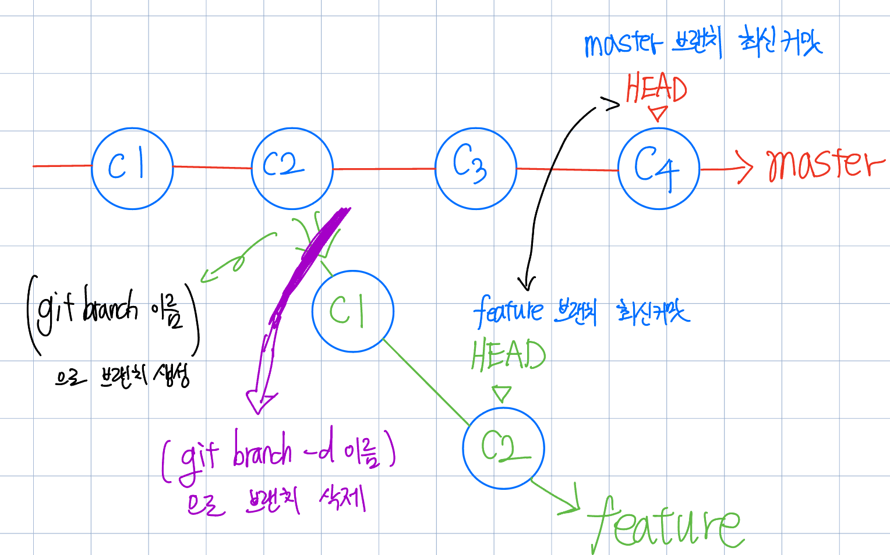

# Git 기초
Git을 사용하려면 알아야 할 기본 지식을 학습합시다. 아래 항목 위주로 조사하여 나름 이해한대로 채워주시기 바랍니다. 이 템플릿을 이용해도 되고, 자유 형식으로 정리하셔도 됩니다. 블로그 등에 정리한 경우 링크를 첨부해주세요.

## Git != Github
  

### Git - 버전 관리 시스템
1. 코드의 수정내역 열람 및 특정시점으로 되돌아가는 기능을 제공하는 버전관리 시스템
2. local에서 동작해 내 코드의 버전들을 관리
3. 그래서 Git 자체만으론 다른 사람들과의 협업이 어려움

### Github - 원격 저장소
1. Git 사용 프로젝트를 지원하는 웹 호스팅 서비스
2. local에서 작업한 코드를 깃헙의 remote 저장소에 업로드
3. 또한 다른 사람이 remote에 올린 코드를 내 local로 받아올 수 있음
4. 이를 통해 다른 사람들과의 협업이 수월해짐

## Git Workflow
   
- 작업 디렉토리 코드는 아직 변경사항이 기록되지 않고있는 **untracked** 상태
- **git add** 명령어를 통해 코드를 Staging Area로 옮겨 **tracked**되게 함
- 스테이징 영역에 있는 코드들을 **git commit** 명령어로 커밋
- 커밋된 코드들은 로컬 저장소에 모임
- 이 로컬 저장소를 **git push** 명령어로 github등의 원격 저장소에 업로드

## Branch, HEAD
  

- **git branch 브랜치명**으로 branch를 만들어 코드의 시점을 나눌 수 있다.
- **git checkout** 명령어를 통해 자유롭게 브랜치들을 오갈 수 있다.
- 이때 *HEAD*는 현재 사용자가 위치한 브랜치의 최신 커밋을 가리키는 포인터이다.
- **git branch -d 브랜치명**으로 브랜치를 삭제할 수도 있다.

## clone, init, origin

- git init은 로컬의 어떤 프로젝트를 git으로 관리하게 만드는 명령어
- git clone <주소>는 저장소로부터 프로젝트를 복제(clone..)해오는 명령어
    - 클론해온 프로젝트엔 origin이라는 원격 저장소 디폴트명이 자동등록된다.
    - origin은 원격저장소 URL을 내포하며 **git remote -v**로 확인 가능.
    - **git remote add 단축명 url**로 원격 저장소를 추가할 수 있는데 이때는 origin 말고 다른 단축명을 사용할 수도 있다. 

## reset
  
**git reset option(기본은 mixed) 커밋위치** 명령어는 단순하게 현재 HEAD가 가리키는 커밋을 옮길 수 있다.
이 때 옮기고 처리하는 방식에 따라 3가지로 나뉜다.
1. HEAD가 가리키는 커밋 위치를 옮긴다. (여기까지가 --soft 옵션) -> 아직 기존 코드 스테이징돼있음
2. staging area를 HEAD가 가리키는 상태로 만든다. (여기까지가 --mixed 옵션) -> 아직 기존 코드는 작업폴더에 있음
3. working directory를 staging area가 가리키는 상태로 만든다. (여기까지가 --hard 옵션)

> A-git add수행-B-git commit ..수행-C 일때 soft는 B로, mixed는 A로, hard는 현재 HEAD 이후로 작성한 코드가 없는 시점으로 이동한다.

## Pull Request, Merge
  
Pull Request와 Merge에 대한 내용을 적어주세요.  
특히 Merge의 두 타입인 Fast-Forward와 3-Way Merge를 포함해주세요.

## rebase
  
rebase란 무엇인지, 어떤 때에 유용한지 등에 대해 적어주세요.

## stash
  
git stash를 활용하는 방법에 대해 적어주세요.

## Advanced
다음 주제는 더 조사해볼만한, 생각해볼만한 것들입니다. 
- `git rebase --interactive`란?
- branch의 upstream이란? (`git push --set-upstream`)
- PR은 브랜치 뿐만 아니라 Fork한 리포지토리에서도 가능하다. fork은 언제 유용한지. 
- `git fetch`와 `git pull`의 차이점, fetch는 언제 쓰는지
- `reset --hard`와 `push --force`의 적절한 사용법
- `.gitignore` 사용법
- 브랜치 이름은 슬래시를 통해 계층적으로 가질 수 있다. 단, `parent/child-1`, `parent/child-2`는 동시에 가질 수 있지만 `parent/child/grandchild`, `parent/child`는 그러지 못한다. 무슨 이유 때문인지. 
- detached HEAD란 어떤 상태인지, 이 상태에서 커밋을 하게 되면 어떻게 되는지, detached HEAD는 어떤 상황에서 발생할 수 있는지

## Questions
조사/실습하면서 생긴 궁금점이 있다면 여기에 적어서 공유해주세요.
