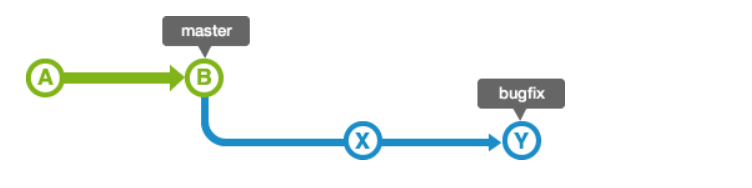

# Git 기초

Git을 사용하려면 알아야 할 기본 지식을 학습합시다. 아래 항목 위주로 조사하여 나름 이해한대로 채워주시기 바랍니다. 이 템플릿을 이용해도 되고, 자유 형식으로 정리하셔도 됩니다. 블로그 등에 정리한 경우 링크를 첨부해주세요.

## Git != Github

  
git과 github는 같은 의미가 아닙니다.  
local, remote와 연관지어 적어주세요.

**개인 컴퓨터에서 사용하는 git을 local git이라 부르며, github나 gitlab과 같은 클라우드에 저장하는 git을 remote git이라고 한다.**

### Git

git은 본인의 코드와 수정내역을 기록하고 관리하는 버전 관리 프로그램으로 로컬에서 프로젝트의 기록을 스스로 관리할 수 있도록 해줌 
git을 통해 브랜치 생성, 삭제, 복구, 병합이 가능하지만 로컬 저장소를 사용하기 때문에 협업시 사용이 불가능함

### GitHub

github는 git저장소를 관리하는 호스팅 서비스로 다른 사람과 소스코드 공유가 가능하며 한 프로젝트에 여러 명의 사람이 참여하여 버전 제어 및 공동 작업이 가능하다.   즉, git으로 관리하는 프로젝트를 올려둘 수 있는 사이트로 github외 gitlab, bitbucket 등 여러가지 사이트가 있다.

## Git Workflow

  
위는 git이 어떻게 동작하는지 나타낸 다이어그램입니다.  
Working Directory, Git Add, Git Commit, Git Push 등 각 항목에 대해 작성 바랍니다.  
Git Merge, Git Fetch는 생략해도 됩니다.

### Working Directory

사용자의 현재 작업 공간으로 실제 파일을 수정하거나 생성하는 공간

- 2가지 상태

1. untracked - 아직 tracking이 되지 않은 파일 : 새로 생성한 파일이거나 변경된 상태가 없는 파일
2. tracked - unmodified/modified로 나눌 수 있음 : modified는 수정사항이 있지만 스테이지 영역으로 옮겨지지 않은 파일로 modified된 파일만 스테이징 영역으로 갈 수 있다.

### Git Add

Working Directory상의 변경 내용을 스테이징 영역에 추가한다.

### Git Commit

현재 버전의 코드(스테이징 되어 있는)를 로컬 저장소에 기록한다.

### Git Push

로컬 저장소에 저장된 변경 이력을 원격 저장소에 반영한다.

## Branch, HEAD

  
git이 동작하는 기본 단위는 commit과 branch입니다.  
branch와 HEAD, git checkout을 포함하여 작성 바랍니다.  
branch 생성 및 삭제, 이동 커맨드 등 자유롭게 내용을 추가해주세요.

### Commit

git에서 commit은 프로젝트의 현재 스테이징된 변경 사항의 스냅샷을 캡처한 것이다.

### branch

branch는 독립적으로 특정 작업을 진행하기 위해 하나의 버전에서 분기되어 생성된 것으로 여러 작업을 동시에 진행 할 수 있게 한다.

- branch 생성
  git branch [branch 이름]
  git checkout -b [branch 이름]
- branch 삭제
  git branch -d [branch 이름]
- branch 이동
  git checkout [branch 이름]

### HEAD

모든 branch에는 HEAD가 존재하는데, HEAD는 해당 브랜치의 마지막 commit을 가리킨다.

## clone, init, origin

리포지토리를 로컬에 생성하는 방법은 clone, init이 있습니다. 다음을 포함하여 작성 바랍니다.

- git clone과 git init의 차이점, 이용방법
- origin이란 키워드는 무엇인지, 어떻게 설정하는지

 

**git 저장소 생성 방법에는 git init과 git clone이 있음**

### git init

현재 디렉토리를 git local 저장소로 설정하는 명령어  
local -> remote 방향  
이용 방법: git으로 관리하기를 원하는 디렉토리에서 $git init

### git clone

이미 만들어진 remote 저장소를 들고오는 명령어  
remote -> local로 git repository를 복제해온다.  
이용 방법: $git clone [로컬 저장소 경로]

### origin

origin은 원격 저장소의 경로 이름을 의미한다. 
git remote add origin [url]형식으로 원격 저장소를 추가하거나 
git clone을 통해 원격저장소를 복사하면 자동으로 origin이라는 이름의 원격 저장소가 등록된다.

## reset

  
reset에는 3가지 타입이 있습니다.  
각 타입에 대해 작성 바랍니다.

**사용법: $ git reset [commitId]**

### --hard

해당 commitId의 상태로 이동하고, **Working Directory와 스테이징 영역을 모두 초기화**한다. 해당 commitId 이후의 모든 내용을 지운다.

### --mixed

해당 commitId의 상태로 이동하고, **스테이징 영역은 초기화되고 Working Directory는 변경되지 않는다.** 즉 **git add가 실행되기 직전의 상태**로 돌아간다.

### --soft

해당 commitId의 상태로 이동하고, **스테이징 영역과 Working Directory모두 변경되지 않는다.** 즉 **git add가 실행된 직후의 상태**로 돌아간다.

## Pull Request, Merge

  
Pull Request와 Merge에 대한 내용을 적어주세요.  
특히 Merge의 두 타입인 Fast-Forward와 3-Way Merge를 포함해주세요.

### Pull Request

Pull Request란 다른 사용자가 작성한 저장소에서 변경 사항을 병합(merge)하기 위한 요청을 의미한다.

Pull Request는 다음과 같은 기능을 제공한다.

- 원본 저장소 소유자에게 코드 변경 사항을 알린다.
- 변경 사항의 리뷰를 받는다.
- 코드 변경 사항이 다른 사람들과 공유될 수 있다.

### Merge

git branch를 다른 branch로 합치는 과정이다.

1. Fast Foward Merge  
   가장 기본적인 merge로 현재 branch의 HEAD를 대상 branch의 HEAD까지 옮기는 merge이다.  
   사용 방법:  
   git switch [현재 branch]  
   git merge [대상 branch]
   
   사진의 bugfix 브랜치의 이력은 master branch의 이력을 모두 포함하고 있기 때문에 master branch 상태가 변경되어 있지 않으면 master branch는 단순히 이동하기만 해도 bugfix branch의 내용을 적용할 수 있다.
   

   하지만 bugfix branch로 분기한 후에 master branch에 여러 변경 사항이 적용되는 경우 master branch의 변경 내용과 bugfix branch의 변경 내용을 하나로 통합해야 한다.
   
   따라서 양쪽의 변경을 가져온 merge commit을 실행하게 된다. (이게 3-Way-Merge로 진행되는 것인가...?)
   

   만약 두 branch가 같은 부분을 수정했다면 conflict가 생기게 되는데  
     
   conflict를 해결하기 위해 변경 사항을 잘 반영해서 commit을 해주어야 한다.

2. 3-Way Merge  
   merge할 때 각 branch의 마지막 commit과 branch의 공통 조상(base) commit 총 3개의 commit을 비교하여 새로운 commit을 만들어 병합을 수행한다.  
   하나의 branch와 다른 branch의 모든 변경 이력을 합치는 방식으로 진행된다.  
   base를 기준으로 변경사항이 있는 파일들을 merge commit에 반영한다. 만약 두 commit 모두에서 변경사항이 발생하여 충돌이 발생하면 충돌을 해결한 후 commit 해주면 된다.

## rebase

  
rebase란 무엇인지, 어떤 때에 유용한지 등에 대해 적어주세요.

Git에서 한 branch에서 다른 branch로 합치는 방법은 Merge와 Rebase가 있다.  
Rebase는 두 개의 공통 base를 가진 branch에서 한 branch의 base를 다른 branch의 최신 commit으로 base를 옮기는 작업이다.  
Merge와 Rebase의 실행 결과는 같지만 commit 히스토리가 달라진다.  
Merge는 쉽고 안전하지만 commit 히스토리가 지저분할 수 있다. Rebase를 사용하면 commit 히스토리를 깔끔하게 관리할 수 있다. 특히 분기한 branch가 많을수록 commit 히스토리를 심플하게 유지하여 commit 추적을 용이하게 한다.  

Rebase의 위험성
사람들이 사용하고 있는 commit을 Rebase하면 문제가 생긴다.  
push하기 전에 로컬에서만 rebase를 사용하자.

## stash

  
git stash를 활용하는 방법에 대해 적어주세요.

**하던 작업을 스택에 임시로 저장하고 나중에 다시 꺼내올 수 있다.**

어떤 작업을 하던 중 다른 요청이 들어와 작업을 멈추고 브랜치를 변경해야 하는데 아직 완료되지 않은 경우 commit을 하지 않고 stash를 사용할 수 있다. (checkout을 하기전에 꼭 commit을 해야하기 때문) 

사용 방법

- $ git stash: 변경 내용 임시 저장하기
- $ git stash list: stash한 list 보기
- $ git stash apply: 가장 최근 stash 가지고 오기
- $ git stash apply [stash 이름]: 특정 stash 가지고 오기
- $ git stash drop: 가장 최근 stash 지우기
- $ git stash drop [stash 이름]: 특정 stash 지우기
- $ git stash clear: stash 모두 지우기
- $ git stash pop: 가장 최근 stash를 적용하고 동시에 stack에서 지우기 (apply + drop)
- $ git stash pop [stash 이름]: 특정 stash를 적용하고 동시에 stack에서 지우기 (apply + drop)
- $ git stash save [stash 이름]: stash 이름 지정하여 저장하기

## Advanced

다음 주제는 더 조사해볼만한, 생각해볼만한 것들입니다.

- `git rebase --interactive`란?  

  불필요한 commit 이력을 제거하여 commit 추적을 용이하게 한다.  

- branch의 upstream이란? (`git push --set-upstream`) 

  upstream은 local 저장소와 연결된 remote 저장소를 의미한다.  
  $ git push --set-upstream A B: 로컬 A 저장소의 원격 저장소를 B로 지정하여 B에 push

- PR은 브랜치 뿐만 아니라 Fork한 리포지토리에서도 가능하다. fork은 언제 유용한지. 

  fork를 하면 원본 저장소의 복사본이 만들어지고 복사본에서 작업을 하기 때문에 branch를 새로 만들지 않고 master에서 작업이 가능하다. 
  원본 저장소에 변경분을 반영하기 위해 PR을 요청하고 승인되면 원본 저장소에 기여자로 등록된다.  

- `git fetch`와 `git pull`의 차이점, fetch는 언제 쓰는지 

  fetch는 원격 저장소에 변경사항이 있는지 확인만 하고 변경된 데이터를 로컬로 가져오지 않음 - 원격 저장소에서 commit된 코드를 임시 branch로 모두 내려받은 후 해당 branch로 checkout하여 변경된 내용을 확인, Working Directory에 변화X 
  pull은 원격 저장소에서 변경된 메타데이터 정보 확인과 최신 데이터를 복사하여 로컬로 가져옴. (fetch + merge) 

- `reset --hard`와 `push/pull --force`의 적절한 사용법  

  **push -f**  
  원격 저장소의 내용을 로컬 저장소의 내용과 일치하도록 강제로 덮어쓴다. 원격 저장소에 저장된 commit 내용 중 일부가 유실될 수 있음.  
  적절한 사용법

  - 덮어쓰기 하려는 변경사항을 현재 사용자 외에 다른 사람들이 pull하지 않은 경우  
  - push -f를 수행한 이후, 모든 사용자로 하여금 pull하여 변경 사항을 새로운 버전으로 재적용하기로 합의가 된 경우  
  - -force-with-lease 옵션 사용 : 덮어쓰기 하기 전 수정사항이 없을 때만 덮어쓰기가 수행된다.  

  **pull -f**  
  로컬 branch의 변경 사항을 무시하고 원격 저장소의 최신 변경사항으로 로컬 branch를 강제로 업데이트하는데 사용 

  **reset --hard를 사용하여 덮어쓰기와 같은 효과를 만들 수 있다**  

  1. git fetch --all : git pull 받을 목록을 저장소에서 업데이트  
  2. git reset --hard origin/[작업중인 branch 이름]: git reset --hard로 head를 최신 버전으로 가리킨다  
  3. git pull  

 

- `.gitignore` 사용법 

  git에 추가되지 말아야 할 파일을 정의한다. 
  [folder name]/ : 특정 폴더에 있는 전체 파일 무시 
  \*.[확장자] : 특정 확장자 전체 무시 
  [디렉터리명]/[파일명] : 특정 파일 무시 

- 브랜치 이름은 슬래시를 통해 계층적으로 가질 수 있다. 단, `parent/child-1`, `parent/child-2`는 동시에 가질 수 있지만 `parent`, `parent/child`는 그러지 못한다. 무슨 이유 때문인지. 

  git은 파일시스템과 유사한 계층 구조를 가지고 있다.  
  branch는 파일로 존재하는데, 만약 parent/child인 branch가 있고, parent인 brach를 생성하려고 한다면 parent라는 파일이 생성되어야 하는데 디렉토리 이름과 겹치기 때문에 생성할 수 없다.

- detached HEAD란 어떤 상태인지, 이 상태에서 커밋을 하게 되면 어떻게 되는지
  **detached HEAD** 
  https://devcamus.tistory.com/6 - 그림으로 이해하기 쉬운 설명이 있어서 참조하였습니다. 
  head가 branch로부터 떨어져 있는 상태를 뜻한다. branch를 통해서가 아니라 head가 직접 commit을 참조하고 있는 상태.  
  (보통 attacehd 상태이면 head -> branch -> commit의 참조 순서를 가진다.)  
  git checkout [revision number]명령어를 사용해, 특정 commit으로 checkout하여 head가 변경된 경우 detached head 상태가 된다. 

  **detached HEAD상태에서 commit**  
  detached HEAD 상태에서 commit을 하면 어떤 branch도 commit을 가리키지 않으므로 branch로부터 분리된 상태로 남게된다.  
  이 commit에 접근하기 위해서 git branch -f [branch 명] HEAD 와 같이 branch를 HEAD가 가리키는 commit으로 강제 이동시키고 git checkout [branch 명]을 하여 head가 해당 branch를 참조하게끔 checkout 해주면 된다.  
  즉, 핵심은 head -> branch -> commit의 참조 순서를 만들어주면 된다!  

## Questions

조사/실습하면서 생긴 궁금점이 있다면 여기에 적어서 공유해주세요.

git에 대해 잘 모르고 있다는 것을 느낄 수 있었다.  
특히 Rebase부분은 아직 잘 이해가 안된 것 같다. 스터디를 진행하면서 더 이해를 해봐야겠다.
